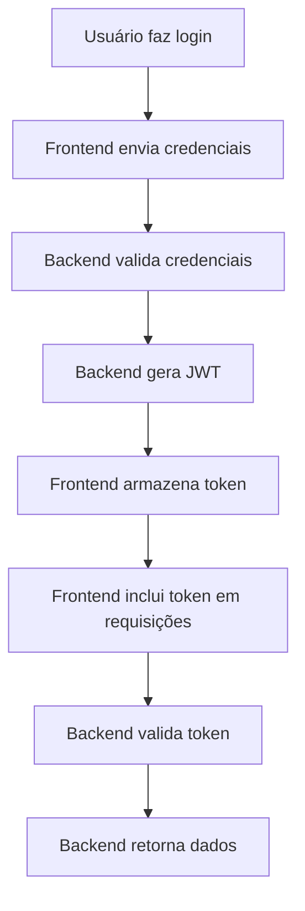
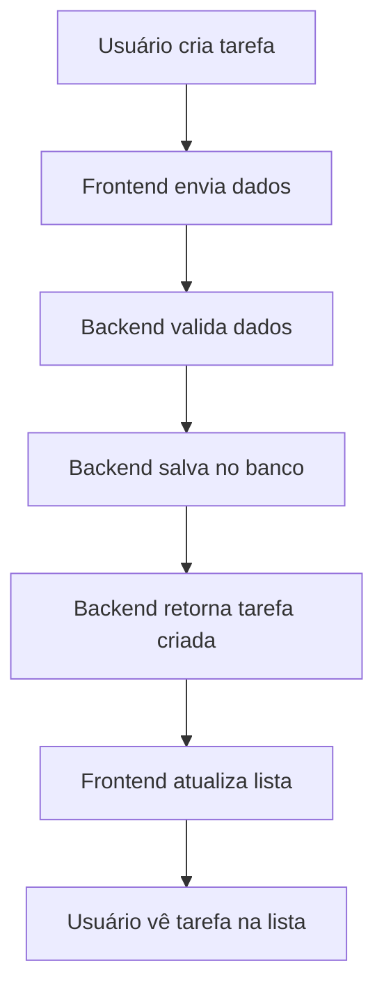
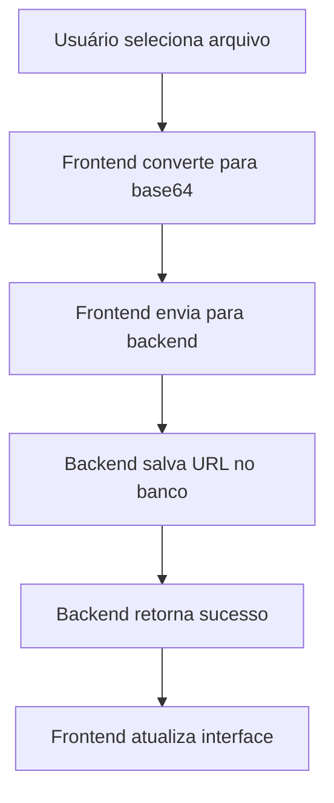
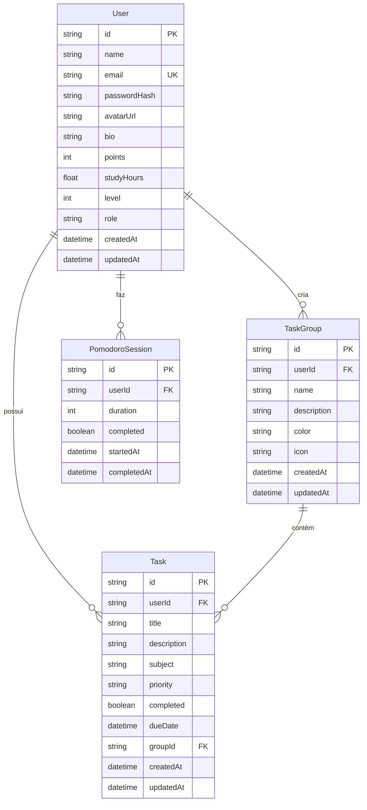

# 🏗️ ARQUITETURA - STUDYHUB

## 📐 Visão Geral da Arquitetura

O StudyHub segue uma arquitetura **full-stack moderna** com separação clara entre frontend e backend:

```
┌─────────────────────────────────────────────────────────────┐
│                        FRONTEND                             │
│  ┌─────────────┐  ┌─────────────┐  ┌─────────────┐        │
│  │   React     │  │   Vite      │  │  TypeScript │        │
│  │  (UI/UX)    │  │  (Build)    │  │  (Types)    │        │
│  └─────────────┘  └─────────────┘  └─────────────┘        │
└─────────────────────────────────────────────────────────────┘
                              │
                              │ HTTP/HTTPS
                              │ JSON API
                              │
┌─────────────────────────────────────────────────────────────┐
│                        BACKEND                              │
│  ┌─────────────┐  ┌─────────────┐  ┌─────────────┐        │
│  │   Express   │  │   Prisma    │  │   JWT       │        │
│  │  (Server)   │  │  (ORM)      │  │  (Auth)     │        │
│  └─────────────┘  └─────────────┘  └─────────────┘        │
└─────────────────────────────────────────────────────────────┘
                              │
                              │ SQL Queries
                              │
┌─────────────────────────────────────────────────────────────┐
│                    DATABASE LAYER                           │
│  ┌─────────────┐  ┌─────────────┐  ┌─────────────┐        │
│  │ PostgreSQL  │  │    Redis     │  │   Docker    │        │
│  │ (Primary)   │  │  (Cache)    │  │(Container)  │        │
│  └─────────────┘  └─────────────┘  └─────────────┘        │
└─────────────────────────────────────────────────────────────┘
```

## 🎯 Princípios Arquiteturais

### **1. Separação de Responsabilidades**
- **Frontend**: Interface, interação, estado local
- **Backend**: Lógica de negócio, dados, autenticação
- **Database**: Persistência, relacionamentos

### **2. API-First Design**
- **RESTful APIs** para comunicação
- **JSON** como formato de dados
- **JWT** para autenticação stateless

### **3. Component-Based Frontend**
- **React Components** reutilizáveis
- **Zustand** para estado global
- **TypeScript** para tipagem

### **4. Database-First Backend**
- **Prisma ORM** para abstração
- **PostgreSQL** como banco principal
- **Redis** para cache e sessões

## 📁 Estrutura de Diretórios

### **Frontend (`/frontend/`)**
```
frontend/
├── src/
│   ├── components/          # Componentes reutilizáveis
│   │   ├── Layout.tsx      # Layout principal
│   │   ├── TaskForm.tsx    # Formulário de tarefas
│   │   ├── GroupManager.tsx # Gerenciador de grupos
│   │   └── FileUpload.tsx  # Upload de arquivos
│   ├── pages/              # Páginas da aplicação
│   │   ├── Dashboard.tsx   # Página inicial
│   │   ├── Tasks.tsx      # Página de tarefas
│   │   ├── Profile.tsx     # Página de perfil
│   │   └── Admin.tsx       # Página de admin
│   ├── lib/                # Serviços e APIs
│   │   ├── api.ts          # Cliente HTTP
│   │   ├── authApi.ts      # API de autenticação
│   │   ├── tasksApi.ts     # API de tarefas
│   │   └── groupsApi.ts    # API de grupos
│   ├── store/              # Estado global
│   │   └── useStore.ts     # Store Zustand
│   ├── types/              # Tipos TypeScript
│   │   ├── task.ts         # Tipos de tarefas
│   │   └── group.ts        # Tipos de grupos
│   └── App.tsx             # Componente principal
├── public/                 # Arquivos estáticos
└── package.json           # Dependências
```

### **Backend (`/backend/`)**
```
backend/
├── src/
│   ├── app-working.js      # Servidor principal
│   └── app-real.ts         # Versão TypeScript (opcional)
├── prisma/
│   ├── schema.prisma       # Schema do banco
│   └── migrations/         # Migrações automáticas
├── docker-compose.yml      # Containers Docker
└── package.json           # Dependências
```

## 🔄 Fluxo de Dados

### **1. Autenticação**


### **2. CRUD de Tarefas**


### **3. Upload de Arquivos**


## 🗄️ Modelo de Dados

### **Entidades Principais**

#### **User (Usuário)**
```typescript
interface User {
  id: string;           // ID único
  name: string;         // Nome do usuário
  email: string;        // Email (único)
  passwordHash: string; // Senha criptografada
  avatarUrl?: string;   // URL da foto de perfil
  bio?: string;         // Biografia
  points: number;       // Pontos de gamificação
  studyHours: number;   // Horas estudadas
  level: number;        // Nível do usuário
  role: string;         // 'user' ou 'admin'
  createdAt: Date;      // Data de criação
  updatedAt: Date;      // Data de atualização
}
```

#### **Task (Tarefa)**
```typescript
interface Task {
  id: string;           // ID único
  userId: string;       // ID do usuário
  title: string;        // Título da tarefa
  description?: string; // Descrição
  subject: string;      // Matéria
  priority: Priority;   // LOW, MEDIUM, HIGH
  completed: boolean;   // Status de conclusão
  dueDate?: Date;       // Data de vencimento
  groupId?: string;     // ID do grupo (opcional)
  createdAt: Date;      // Data de criação
  updatedAt: Date;      // Data de atualização
}
```

#### **TaskGroup (Grupo de Tarefas)**
```typescript
interface TaskGroup {
  id: string;           // ID único
  userId: string;       // ID do usuário
  name: string;         // Nome do grupo
  description?: string; // Descrição
  color: string;        // Cor do grupo
  icon: string;         // Ícone do grupo
  createdAt: Date;      // Data de criação
  updatedAt: Date;      // Data de atualização
}
```

#### **PomodoroSession (Sessão Pomodoro)**
```typescript
interface PomodoroSession {
  id: string;           // ID único
  userId: string;       // ID do usuário
  duration: number;     // Duração em minutos
  completed: boolean;   // Se foi completada
  startedAt: Date;      // Data de início
  completedAt?: Date;   // Data de conclusão
}
```

### **Relacionamentos**



## 🔌 Comunicação Frontend-Backend

### **Cliente HTTP (`lib/api.ts`)**
```typescript
import axios from 'axios';

const api = axios.create({
  baseURL: 'http://localhost:3001/api',
  timeout: 10000,
});

// Interceptor para adicionar token
api.interceptors.request.use((config) => {
  const token = localStorage.getItem('token');
  if (token) {
    config.headers.Authorization = `Bearer ${token}`;
  }
  return config;
});

// Interceptor para tratar erros
api.interceptors.response.use(
  (response) => response,
  (error) => {
    if (error.response?.status === 401) {
      localStorage.removeItem('token');
      window.location.href = '/login';
    }
    return Promise.reject(error);
  }
);
```

### **Padrão de Resposta da API**
```typescript
// Sucesso
{
  "success": true,
  "message": "Operação realizada com sucesso",
  "data": { /* dados */ }
}

// Erro
{
  "success": false,
  "message": "Descrição do erro",
  "error": "Código do erro (opcional)"
}
```

## 🎨 Padrões de Design

### **1. Component-Based Architecture**
- **Componentes reutilizáveis** para UI
- **Props** para comunicação entre componentes
- **Hooks** para lógica de estado

### **2. State Management**
- **Zustand** para estado global
- **useState** para estado local
- **useEffect** para efeitos colaterais

### **3. API Layer**
- **Serviços separados** por domínio
- **Tipos TypeScript** para contratos
- **Interceptors** para tratamento global

### **4. Error Handling**
- **Try-catch** em operações assíncronas
- **Toast notifications** para feedback
- **Fallback UI** para estados de erro

## 🔒 Segurança

### **Autenticação**
- **JWT tokens** com expiração
- **Hash de senhas** com bcrypt
- **Middleware de autenticação** em rotas protegidas

### **Autorização**
- **Role-based access** (user/admin)
- **Validação de propriedade** de recursos
- **Sanitização** de inputs

### **CORS**
- **Origem específica** configurada
- **Headers permitidos** definidos
- **Métodos HTTP** restritos

## 📊 Monitoramento

### **Logs**
- **Console.log** para desenvolvimento
- **Error tracking** para produção
- **Request/Response** logging

### **Métricas**
- **Tempo de resposta** das APIs
- **Taxa de erro** das requisições
- **Uso de memória** do servidor

## 🚀 Escalabilidade

### **Frontend**
- **Code splitting** com Vite
- **Lazy loading** de componentes
- **Caching** de assets

### **Backend**
- **Stateless** com JWT
- **Connection pooling** no Prisma
- **Redis** para cache

### **Database**
- **Índices** em campos de busca
- **Relacionamentos** otimizados
- **Migrations** versionadas

---

**📚 Continue explorando: [BACKEND.md](./BACKEND.md) e [FRONTEND.md](./FRONTEND.md)**
