# 🔗 INTEGRAÇÃO - FRONTEND-BACKEND

## 📋 Visão Geral

Este documento explica como o frontend React e o backend Node.js se comunicam no StudyHub, incluindo autenticação, APIs, tratamento de erros e fluxos de dados.

## 🔄 Fluxo de Comunicação

### **Arquitetura de Comunicação**
```
┌─────────────────┐    HTTP/HTTPS    ┌─────────────────┐
│    FRONTEND     │ ◄──────────────► │    BACKEND      │
│   (React)       │    JSON API      │   (Express)     │
└─────────────────┘                  └─────────────────┘
         │                                     │
         │                                     │
         ▼                                     ▼
┌─────────────────┐                  ┌─────────────────┐
│   LocalStorage  │                  │   PostgreSQL    │
│   (JWT Token)   │                  │   (Database)    │
└─────────────────┘                  └─────────────────┘
```

## 🔐 Sistema de Autenticação

### **Fluxo de Login**

```mermaid
graph TD
    A[Usuário insere credenciais] --> B[Frontend envia POST /api/auth/login]
    B --> C[Backend valida credenciais]
    C --> D[Backend gera JWT]
    D --> E[Backend retorna user + token]
    E --> F[Frontend armazena token no localStorage]
    F --> G[Frontend atualiza estado global]
    G --> H[Usuário é redirecionado para Dashboard]
```


### **Implementação no Frontend**
```typescript
// store/useStore.ts
login: async (email: string, password: string) => {
  try {
    const response = await authApi.login(email, password);
    if (response.success) {
      // Armazenar token
      localStorage.setItem('token', response.data.token);
      
      // Atualizar estado global
      set({ 
        user: response.data.user, 
        isAuthenticated: true 
      });
    }
  } catch (error) {
    console.error('Erro no login:', error);
    throw error;
  }
}
```

### **Implementação no Backend**
```javascript
// app-working.js
app.post('/api/auth/login', async (req, res) => {
  try {
    const { email, password } = req.body;
    
    // Buscar usuário
    const user = await prisma.user.findUnique({ where: { email } });
    if (!user) {
      return res.status(401).json({ 
        success: false, 
        message: 'Credenciais inválidas' 
      });
    }
    
    // Verificar senha
    const validPassword = await bcrypt.compare(password, user.passwordHash);
    if (!validPassword) {
      return res.status(401).json({ 
        success: false, 
        message: 'Credenciais inválidas' 
      });
    }
    
    // Gerar JWT
    const token = jwt.sign(
      { userId: user.id, email: user.email, role: user.role },
      process.env.JWT_SECRET || 'secret',
      { expiresIn: '7d' }
    );
    
    res.json({
      success: true,
      message: 'Login realizado com sucesso!',
      data: { user, token }
    });
  } catch (error) {
    res.status(500).json({ 
      success: false, 
      message: 'Erro interno do servidor' 
    });
  }
});
```

## 🔌 Cliente HTTP

### **Configuração do Axios (`lib/api.ts`)**
```typescript
import axios from 'axios';

const api = axios.create({
  baseURL: 'http://localhost:3001/api',
  timeout: 10000,
});

// Interceptor para adicionar token automaticamente
api.interceptors.request.use((config) => {
  const token = localStorage.getItem('token');
  if (token) {
    config.headers.Authorization = `Bearer ${token}`;
  }
  return config;
});

// Interceptor para tratar erros globalmente
api.interceptors.response.use(
  (response) => response,
  (error) => {
    if (error.response?.status === 401) {
      // Token expirado ou inválido
      localStorage.removeItem('token');
      window.location.href = '/login';
    }
    return Promise.reject(error);
  }
);

export default api;
```

### **Middleware de Autenticação no Backend**
```javascript
const requireAuth = (req, res, next) => {
  const token = req.headers.authorization?.replace('Bearer ', '');
  if (!token) {
    return res.status(401).json({ 
      success: false, 
      message: 'Token não fornecido' 
    });
  }
  
  try {
    const decoded = jwt.verify(token, process.env.JWT_SECRET || 'secret');
    req.user = decoded;
    next();
  } catch (error) {
    res.status(401).json({ 
      success: false, 
      message: 'Token inválido' 
    });
  }
};
```

## 📝 API de Tarefas

### **Fluxo de Criação de Tarefa**

```mermaid
graph TD
    A[Usuário preenche formulário] --> B[Frontend valida dados]
    B --> C[Frontend chama tasksApi.createTask]
    C --> D[Axios envia POST /api/tasks]
    D --> E[Backend valida token]
    E --> F[Backend valida dados]
    F --> G[Backend salva no banco]
    G --> H[Backend retorna tarefa criada]
    H --> I[Frontend atualiza lista]
    I --> J[Usuário vê nova tarefa]
```


### **Implementação no Frontend**
```typescript
// lib/tasksApi.ts
const tasksApi = {
  createTask: async (taskData: CreateTaskData) => {
    const response = await api.post('/api/tasks', taskData);
    return response.data;
  },
  
  getTasks: async () => {
    const response = await api.get('/api/tasks');
    return response.data;
  },
  
  updateTask: async (id: string, updates: Partial<Task>) => {
    const response = await api.put(`/api/tasks/${id}`, updates);
    return response.data;
  },
  
  deleteTask: async (id: string) => {
    const response = await api.delete(`/api/tasks/${id}`);
    return response.data;
  }
};
```

### **Implementação no Backend**
```javascript
// POST /api/tasks
app.post('/api/tasks', requireAuth, async (req, res) => {
  try {
    const { title, description, subject, priority, dueDate, groupId } = req.body;
    
    if (!title) {
      return res.status(400).json({ 
        success: false, 
        message: 'Título é obrigatório' 
      });
    }
    
    const priorityMap = { 'low': 'LOW', 'medium': 'MEDIUM', 'high': 'HIGH' };
    
    const task = await prisma.task.create({
      data: {
        title,
        description: description || '',
        subject: subject || 'geral',
        priority: priorityMap[priority] || 'MEDIUM',
        completed: false,
        dueDate: dueDate ? new Date(dueDate) : null,
        groupId: groupId || null,
        userId: req.user.userId
      }
    });
    
    res.status(201).json({
      success: true,
      message: 'Tarefa criada com sucesso!',
      data: { task }
    });
  } catch (error) {
    res.status(500).json({ 
      success: false, 
      message: 'Erro interno do servidor' 
    });
  }
});
```

## 🎨 Padrões de Resposta

### **Formato Padrão de Sucesso**
```typescript
interface ApiSuccessResponse<T> {
  success: true;
  message: string;
  data: T;
}

// Exemplo
{
  "success": true,
  "message": "Tarefa criada com sucesso!",
  "data": {
    "task": {
      "id": "cmfzvuxja0001tvwrp1obikss",
      "title": "Estudar React",
      "description": "Aprender hooks e componentes",
      "subject": "programação",
      "priority": "HIGH",
      "completed": false,
      "createdAt": "2025-09-25T20:46:12.551Z"
    }
  }
}
```

### **Formato Padrão de Erro**
```typescript
interface ApiErrorResponse {
  success: false;
  message: string;
  error?: string;
}

// Exemplo
{
  "success": false,
  "message": "Título é obrigatório",
  "error": "VALIDATION_ERROR"
}
```

## 🔄 Gerenciamento de Estado

### **Estado Global com Zustand**
```typescript
// store/useStore.ts
interface StudyHubStore {
  // Estado
  user: User | null;
  isAuthenticated: boolean;
  
  // Ações
  login: (email: string, password: string) => Promise<void>;
  logout: () => void;
  updateUser: (userData: Partial<User>) => void;
}

export const useStore = create<StudyHubStore>((set) => ({
  user: null,
  isAuthenticated: false,
  
  login: async (email: string, password: string) => {
    try {
      const response = await authApi.login(email, password);
      if (response.success) {
        localStorage.setItem('token', response.data.token);
        set({ 
          user: response.data.user, 
          isAuthenticated: true 
        });
      }
    } catch (error) {
      console.error('Erro no login:', error);
      throw error;
    }
  },
  
  logout: () => {
    localStorage.removeItem('token');
    set({ user: null, isAuthenticated: false });
  }
}));
```

### **Estado Local com useState**
```typescript
// pages/Tasks.tsx
const [tasks, setTasks] = useState<Task[]>([]);
const [loading, setLoading] = useState(false);
const [filter, setFilter] = useState<'all' | 'pending' | 'completed'>('all');

const loadTasks = async () => {
  setLoading(true);
  try {
    const response = await tasksApi.getTasks();
    if (response.success) {
      setTasks(response.data.tasks);
    }
  } catch (error) {
    console.error('Erro ao carregar tarefas:', error);
  } finally {
    setLoading(false);
  }
};
```

## 🚨 Tratamento de Erros

### **Erros de Rede**
```typescript
// lib/api.ts
api.interceptors.response.use(
  (response) => response,
  (error) => {
    if (error.response?.status === 401) {
      // Token expirado
      localStorage.removeItem('token');
      window.location.href = '/login';
    } else if (error.response?.status === 403) {
      // Acesso negado
      toast.error('Acesso negado');
    } else if (error.response?.status >= 500) {
      // Erro do servidor
      toast.error('Erro interno do servidor');
    } else {
      // Outros erros
      toast.error('Erro na requisição');
    }
    return Promise.reject(error);
  }
);
```

### **Tratamento de Erros em Componentes**
```typescript
const handleCreateTask = async (taskData: CreateTaskData) => {
  try {
    const response = await tasksApi.createTask(taskData);
    if (response.success) {
      toast.success('Tarefa criada com sucesso!');
      loadTasks(); // Recarregar lista
    }
  } catch (error) {
    console.error('Erro ao criar tarefa:', error);
    toast.error('Erro ao criar tarefa');
  }
};
```

## 📤 Upload de Arquivos

### **Fluxo de Upload de Avatar**

```mermaid
graph TD
    A[Usuário seleciona imagem] --> B[Frontend converte para base64]
    B --> C[Frontend chama uploadApi.uploadAvatar]
    C --> D[Axios envia POST /api/upload/avatar]
    D --> E[Backend valida token]
    E --> F[Backend salva URL no banco]
    F --> G[Backend retorna usuário atualizado]
    G --> H[Frontend atualiza estado do usuário]
    H --> I[Interface mostra nova foto]
```


### **Implementação no Frontend**
```typescript
// lib/uploadApi.ts
const uploadApi = {
  uploadAvatar: async (avatarUrl: string) => {
    const response = await api.post('/api/upload/avatar', { avatarUrl });
    return response.data;
  }
};

// pages/Profile.tsx
const handlePhotoSelect = async (file: File) => {
  try {
    // Converter para base64
    const reader = new FileReader();
    reader.onload = async (e) => {
      const base64 = e.target?.result as string;
      
      // Fazer upload
      const response = await uploadApi.uploadAvatar(base64);
      
      if (response.success) {
        toast.success('Foto de perfil atualizada!');
        updateUser({ avatar: base64 });
      }
    };
    reader.readAsDataURL(file);
  } catch (error) {
    console.error('Erro ao fazer upload:', error);
    toast.error('Erro ao fazer upload da foto');
  }
};
```

### **Implementação no Backend**
```javascript
// POST /api/upload/avatar
app.post('/api/upload/avatar', requireAuth, async (req, res) => {
  try {
    const { avatarUrl } = req.body;
    
    if (!avatarUrl) {
      return res.status(400).json({ 
        success: false, 
        message: 'URL do avatar é obrigatória' 
      });
    }
    
    const user = await prisma.user.update({
      where: { id: req.user.userId },
      data: { avatarUrl }
    });
    
    res.json({
      success: true,
      message: 'Avatar atualizado com sucesso!',
      data: { user }
    });
  } catch (error) {
    res.status(500).json({ 
      success: false, 
      message: 'Erro interno do servidor' 
    });
  }
});
```

## 🔄 Sincronização de Dados

### **Estratégias de Atualização**
```typescript
// 1. Atualização Imediata (Otimista)
const handleToggleTask = async (id: string, completed: boolean) => {
  // Atualizar UI imediatamente
  setTasks(tasks.map(task => 
    task.id === id ? { ...task, completed } : task
  ));
  
  try {
    // Enviar para backend
    await tasksApi.updateTask(id, { completed });
  } catch (error) {
    // Reverter em caso de erro
    setTasks(tasks.map(task => 
      task.id === id ? { ...task, completed: !completed } : task
    ));
    toast.error('Erro ao atualizar tarefa');
  }
};

// 2. Atualização Após Sucesso (Conservadora)
const handleDeleteTask = async (id: string) => {
  try {
    const response = await tasksApi.deleteTask(id);
    if (response.success) {
      // Atualizar UI apenas após sucesso
      setTasks(tasks.filter(task => task.id !== id));
      toast.success('Tarefa excluída com sucesso!');
    }
  } catch (error) {
    toast.error('Erro ao excluir tarefa');
  }
};

// 3. Recarregamento Completo
const loadTasks = async () => {
  try {
    const response = await tasksApi.getTasks();
    if (response.success) {
      setTasks(response.data.tasks);
    }
  } catch (error) {
    console.error('Erro ao carregar tarefas:', error);
  }
};
```

## 🎯 Boas Práticas

### **1. Separação de Responsabilidades**
- **Frontend**: Interface, validação de formulários, estado local
- **Backend**: Lógica de negócio, validação de dados, persistência
- **API**: Contrato de comunicação, tratamento de erros

### **2. Tratamento de Loading**
```typescript
const [loading, setLoading] = useState(false);

const handleSubmit = async (data: FormData) => {
  setLoading(true);
  try {
    await api.submit(data);
  } finally {
    setLoading(false);
  }
};
```

### **3. Validação de Dados**
```typescript
// Frontend - Validação de formulário
const validateForm = (data: FormData) => {
  if (!data.title.trim()) {
    return 'Título é obrigatório';
  }
  if (data.title.length > 100) {
    return 'Título muito longo';
  }
  return null;
};

// Backend - Validação de API
if (!title) {
  return res.status(400).json({ 
    success: false, 
    message: 'Título é obrigatório' 
  });
}
```

### **4. Cache e Performance**
```typescript
// Cache de dados no frontend
const [tasksCache, setTasksCache] = useState<Task[]>([]);
const [lastFetch, setLastFetch] = useState<number>(0);

const loadTasks = async () => {
  const now = Date.now();
  if (now - lastFetch < 30000) { // 30 segundos
    return tasksCache;
  }
  
  const response = await tasksApi.getTasks();
  setTasksCache(response.data.tasks);
  setLastFetch(now);
  return response.data.tasks;
};
```

## 🔧 Debugging

### **Logs no Frontend**
```typescript
// Console logs para debugging
console.log('Enviando dados:', taskData);
console.log('Resposta recebida:', response);
console.error('Erro na requisição:', error);
```

### **Logs no Backend**
```javascript
// Logs detalhados
console.log('Recebendo requisição:', req.body);
console.log('Usuário autenticado:', req.user);
console.error('Erro na operação:', error);
```

### **Ferramentas de Debug**
- **Network Tab** no DevTools
- **Console** para logs
- **Redux DevTools** (se usando Redux)
- **Postman** para testar APIs

---

**📚 Continue explorando: [API_AUTENTICACAO.md](./API_AUTENTICACAO.md) e [API_TAREFAS.md](./API_TAREFAS.md)**
